# Docker-images
Docker images are the building blocks of containers. they are lightweight, portable and self-sufficient packages that contain everything needed to run a software application, including codes, runtime, libraries and system tool

## step 1: pulling images from Docker hub
* Docker hub is a cloud-based repository that hosts a vast collection of Docker images.

* "docker search" : to explore availabe images on Docker Hub
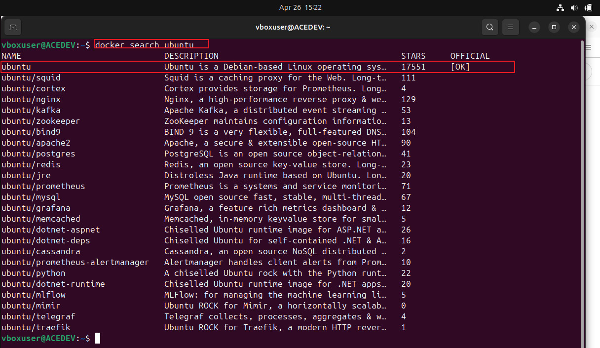
* "docker pull"
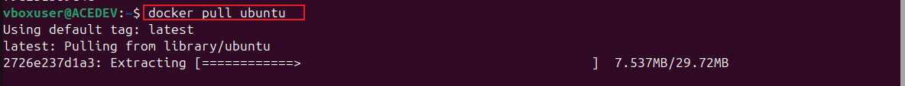
* "docker images"
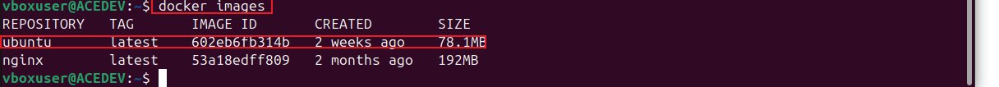

## step 2:  Creating a docker file
* using "nano" command to create qa new file (dockerfile)
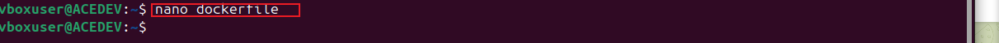
input script into the file:

       # Use the official NGINX base image
       FROM nginx:latest

       # Set the working directory in the container
      WORKDIR  /usr/share/nginx/html/

       # Copy the local HTML file to the NGINX default public directory
       COPY index.html /usr/share/nginx/html/

       # Expose port 80 to allow external access
       EXPOSE 80

       # No need for CMD as NGINX image comes with a default CMD to start the server

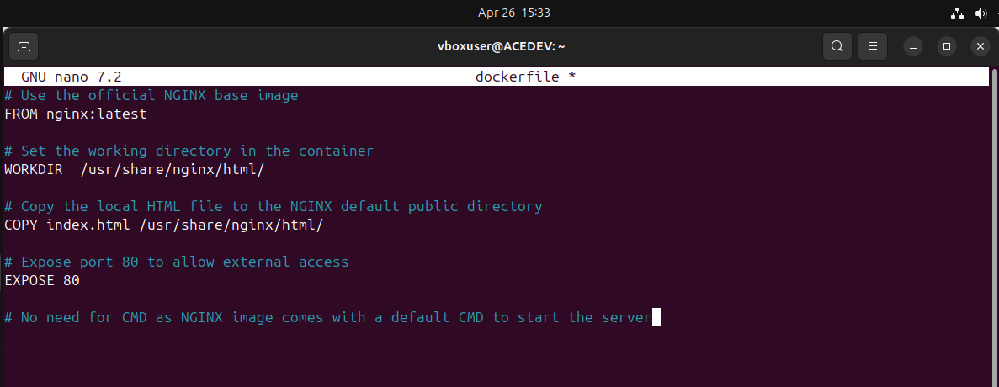
* append instruction into the "index.html" file 

      echo "Welcome to Darey.io" >> index.html
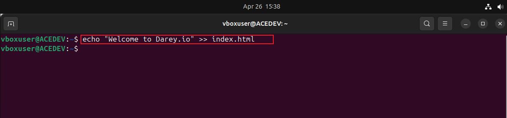

* Build an image from the dockerfile we created

      docker build -t dockerfile .
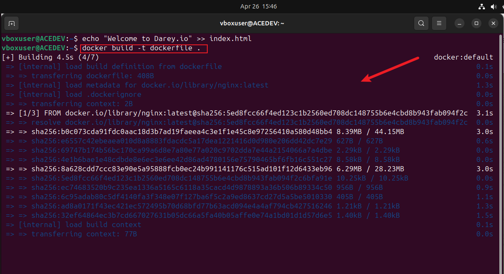

* verfiy the image was successfully built
    
      docker images 
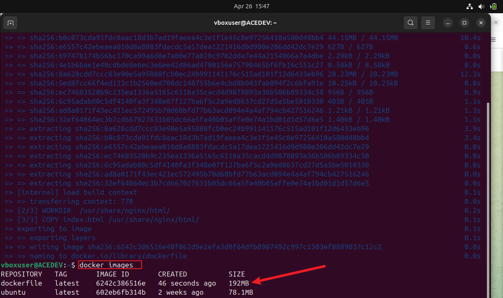

* Run a container based on the NGINX image we created with the dockerfile
  
      docker run -p 8080:80 dockerfile
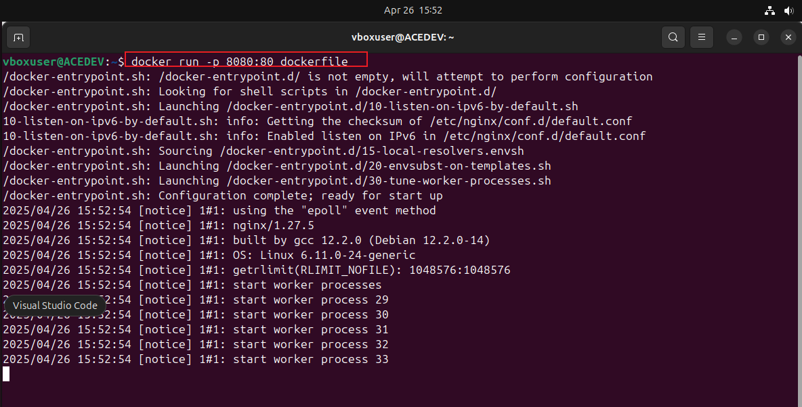

## step 3: create an EC2 instance
* on aws console we create a new EC2 instance and edit the security group to allow all incoming traffic associated to the security group, the aimm is to allow incoming traffic on port 8080docker

* create an EC2 named "doc-ec"
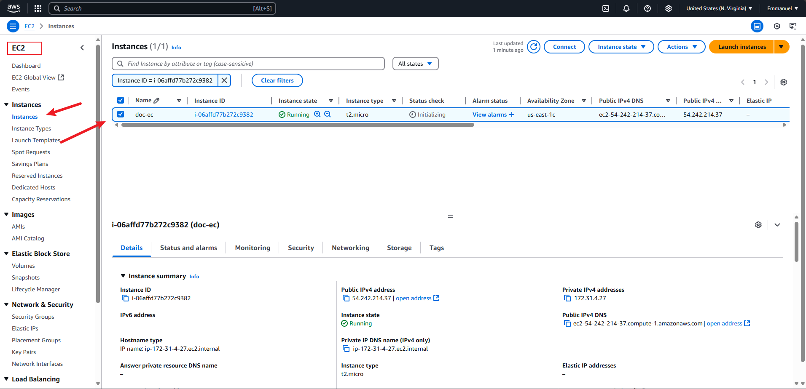
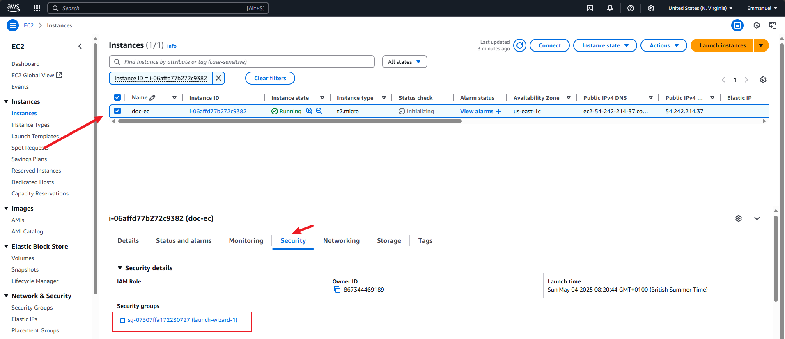
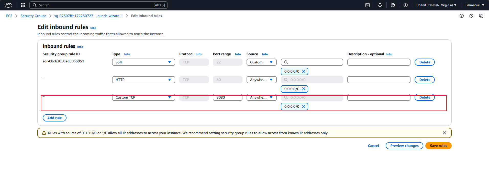

* list available containers "ps-a"
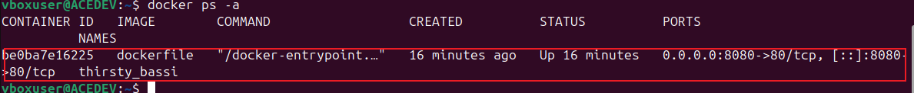
the image above shows  my container "dockerfile" is up
* login to Docker hub and create a repository "firstdi"
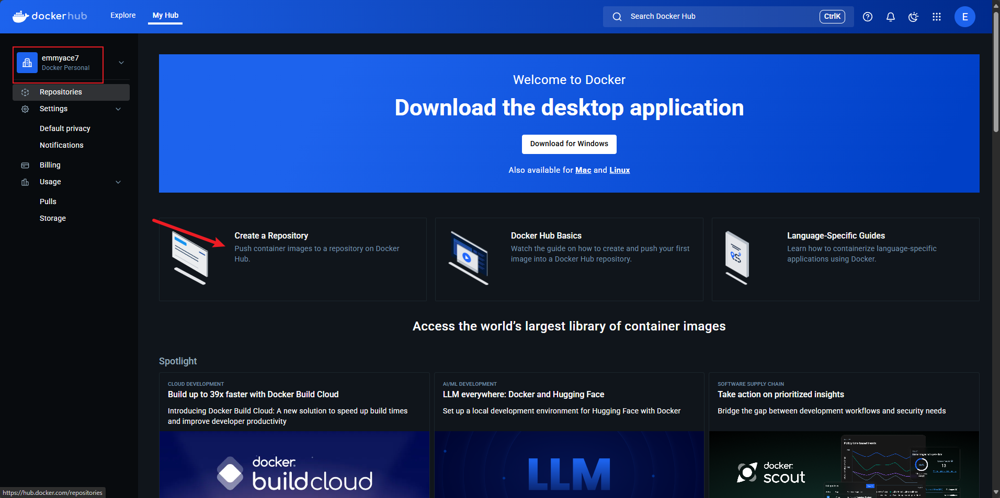
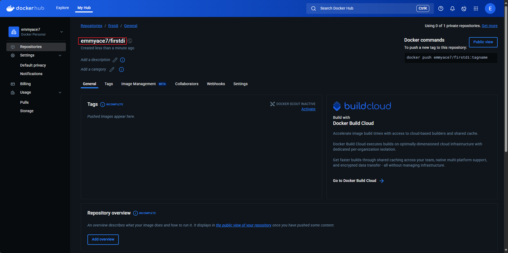
* Tag docker image 
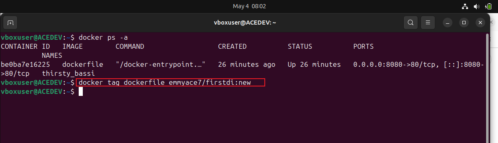
* login to docker hub on the CLI using command "docker login -u emmyace7"
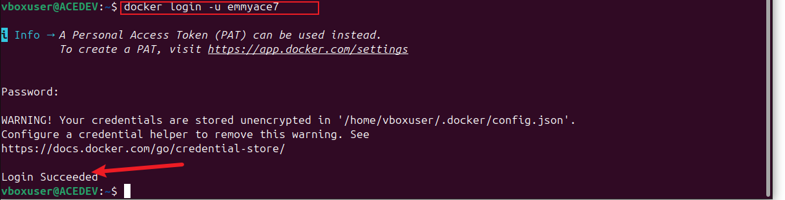
* push the image to docker hub using cmd "docker push "
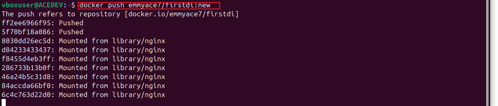
* verify the image was pushed successfully to the repository
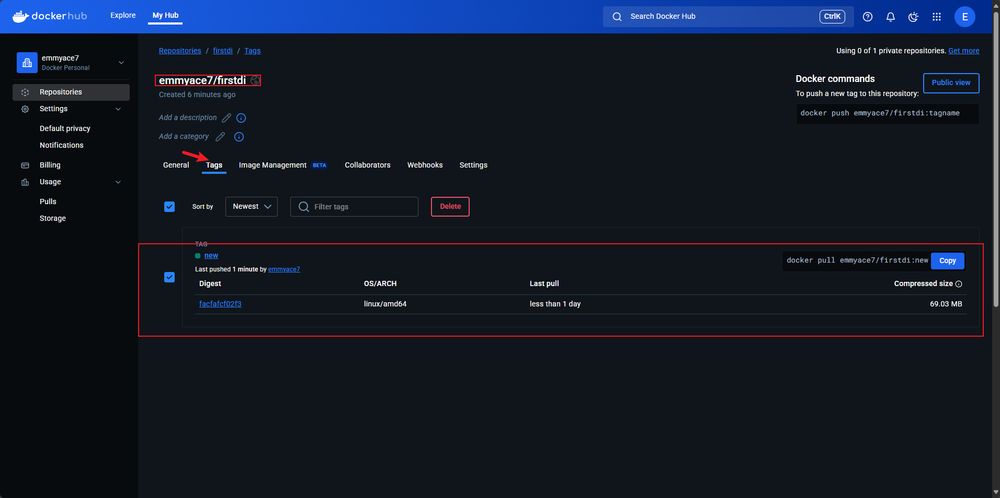

In summary i was able to create a new docker container and also push a docker image into the docker hub.